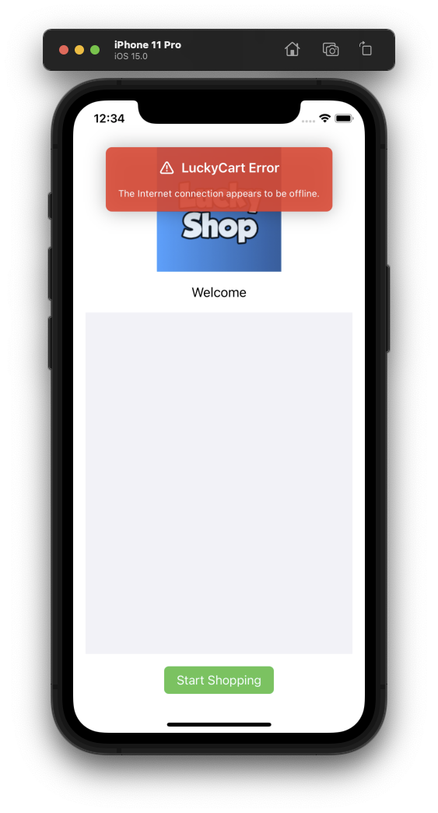

# <font color='#10409F'>Lucky Cart</font>

<b>Lucky Cart Public API</b>

## <font color='#707080'>LuckyCart API</font>
    
### <font color='#007F00'>newCart(with id: String)</font>

Opens a new cart
        
### <font color='#007F00'>setUser(_ user: LCCustomer?)</font>
    
Set current user
    
### <font color='#007F00'>setGuestUser()</font>

Switch to guest user
    
## Public Network API Calls ( Defined in `LuckyCart+Facade` )

### <font color='#007F00'>Check Out</font>

Sends the ticket in LuckyCart format

```

checkOut(ticketComposer: myTicketComposer,
                         failure: { error in },
                         success: { postCartResponse in })
```    
    
### <font color='#007F00'>Load games</font>

Games are usually loaded just after the check out

```
loadGames(failure: { error in },
          success: { games in })
```          
    
### <font color='#007F00'>Load banner spaces</font>

Banner spaces are loaded as soon as the LuckyCart instance is created.
    
```
loadBannerSpaces(failure: { error in },
                 success: { bannerSpaces in })
```
              
### <font color='#007F00'>Load a banner</font>

Banner spaces are loaded as soon as the LuckyCart instance is created.

```    
banner(with identifier: myBannerIdentifier,
       failure: { error in },
       success: { banner in })
```

## <font color='#707080'>Public Model</font>

### <font color='#007F00'>LCCustomer</font>

- id: String

- static guest `LCCustomer(Model.Customer.guest)`

### <font color='#007F00'>LCCart</font>

- id: String

### <font color='#007F00'>LCLink</font>

Wraps a link to an url and an optional image url

- url: URL
- imageUrl: URL?

### <font color='#007F00'>LCGame</font>

- code `String`
- isGamePlayable `Bool
- gameResult `LCGameResult
- desktopLink `LCLink
- mobileLink `LCLink

### <font color='#007F00'>LCGameResult</font>
    
- static notPlayed = LCGameResult(rawValue: "not-played")

### <font color='#007F00'>LCBannerSpaces</font>

- id `UUID`
- identifier `LCBannerSpaceIdentifier`
- bannerIds `[LCBannerIdentifier]`

### <font color='#007F00'>LCEntity</font>

### <font color='#007F00'>LCBannerSpaces</font>

- spaces `[LCBannerSpaceIdentifier: LCBannerSpace]`
- banners `[LCBannerIdentifier: LCBanner]`
    
- sortedSpaces `[LCBannerSpace]` { get }
- var description `String` { get }

    
- subscript (key: `LCBannerSpaceIdentifier`) -> `LCBannerSpace?`

### <font color='#007F00'>LCBannerAction</font>
- type `LCBannerActionType`
- ref `String

### <font color='#007F00'>LCBanner</font>

- id `UUID`
- identifier `LCBannerIdentifier?`

- link `LCLink`
- name `String`
- campaign `String`
- space `String`
- action `LCBannerAction`
    
### <font color='#007F00'>LCBannerActionType</font>

- rawValue `String`
    
- static boutique `LCBannerActionType(rawValue: "boutique")`


### <font color='#007F00'>LCPostCartResponse</font>

- ticket `String`
- mobileUrl `URL?`
- tabletUrl `URL?`
- desktopUrl `URL?`
- baseMobileUrl `URL?`
- baseTabletUrl `URL?`
- baseDesktopUrl `URL?`

### <font color='#707080'>LuckyCart+Types</font>

### <font color='#707080'>LuckyCartClient</font>

## <font color='#707080'>TicketComposer</font>

### <font color='#007F00'>LCTicketComposer</font>

### <font color='#007F00'>LCTicketComposer+Model</font>


## <font color='#10409F'>SwiftUIKit</font>

### <font color='#007F00'>LCBannerView</font>

A view that displays a LuckyCart banner. It simply displays the banner link in a link view.

### <font color='#007F00'>LCButtonModifier</font>

A button style provided by LuckyCart framework.
This button is used for all interactions in sheets, but can also be used by client application.

```
Button("Close") {
    // Action
}
.modifier(LCButtonModifier(color: .blue))
```


### <font color='#007F00'>LCDebugLensModifier</font>

Displays the LuckyCart errors over the client application interface.<br>To enable it ( only in DEBUG mode ), apply the view modifier to the view you want to host error banner. Typically the window root view.

```swift
@main
struct MyShoppingApp: App {

    var body: some Scene {
        WindowGroup {
            ContentView()
            .modifier(LCDebugLensModifier())
        }
    }
}
```



### <font color='#007F00'>LCGameView</font>

A view that displays a LuckyCart game. It simply displays the game link in a link view.

### <font color='#007F00'>LCLinkView</font>

A view that display a link `LCLink`.<br>
The link image can be clicked/tapped which, by default, opens the link in a web view `LCWebView`

### <font color='#007F00'>LCViewProtocols</font>

The view protocols that client app can use to integrate LuckyCart.

- BannerSpaceView - Make your view conform to this protocol to load and display LuckyCart banners
   - bannerSpaceId `LCBannerSpaceIdentifier`
   - bannerIds `[LCBannerIdentifier]`
   - banners `[LCBanner]`

#### <font color='#007F00'>GamesView</font>

Make your view conform to this protocol to load and display LuckyCart games

- GamesView 
	- games `[LCGame]`	

#### <font color='#007F00'>Boutique View</font>

Make your view conform to this protocol to display a "Boutique View".<br>
A Boutique View is a custom view provided by client application that can be accessed via LuckCart banners.

- LCBoutiqueView
	- identifier `LCBoutiqueViewIdentifier`

### <font color='#007F00'>LCWebView</font>

A swiftui ios/macos web view.

### <font color='#007F00'>View+Window</font>

Opens the target view in a new Mac OS window.

- openNewWindow(title: delegate: geometry: style: )


--

©2022 Lucky Cart


