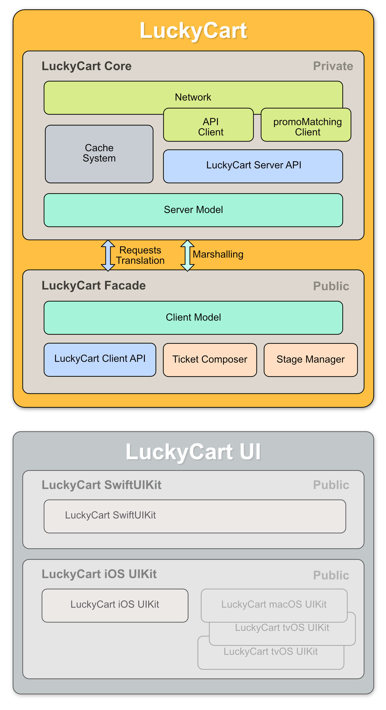

# Lucky Cart

<b>Lucky Cart Connection engine and Swift API</b>

- Connection Layer and server model
- Public API facade and client model
 
## Availability:

- macOS   : .v11
- iOS     : .v13
- tvOS    : .v14
- watchOS : .v8

## Scheme:

	
## Private Part

### Networking

The core classes that manage the session

### Server API

The requests set to communicate with LuckyCart API

### Server Model

The entities as sent by the server
    
- Customer
- Cart
- Game
- Games
- BannerSpaces
- BannerAction
- Banner

## Public Part

### Errors

- cantFormURL
- unknownRequestName
- wrongResponseType
- authKeyMissing
- authorizationMissing

### Client Model

- LCCustomer
- LCCart
- LCLink
- LCGame
- LCGameResult
- LCBanner
- LCBannerSpaces
- LCBannerAction
- LCBannerActionType

### Ticket Composer

A tool that assists framework user to create ticket JSON.

### Sequencer

A tool that manage the current experience stage.

- connecting
- browsing
- checkingOut
- browsingGames
- playing

 

## Installation:

Packages

## Author:

©2022 Lucky Cart 

