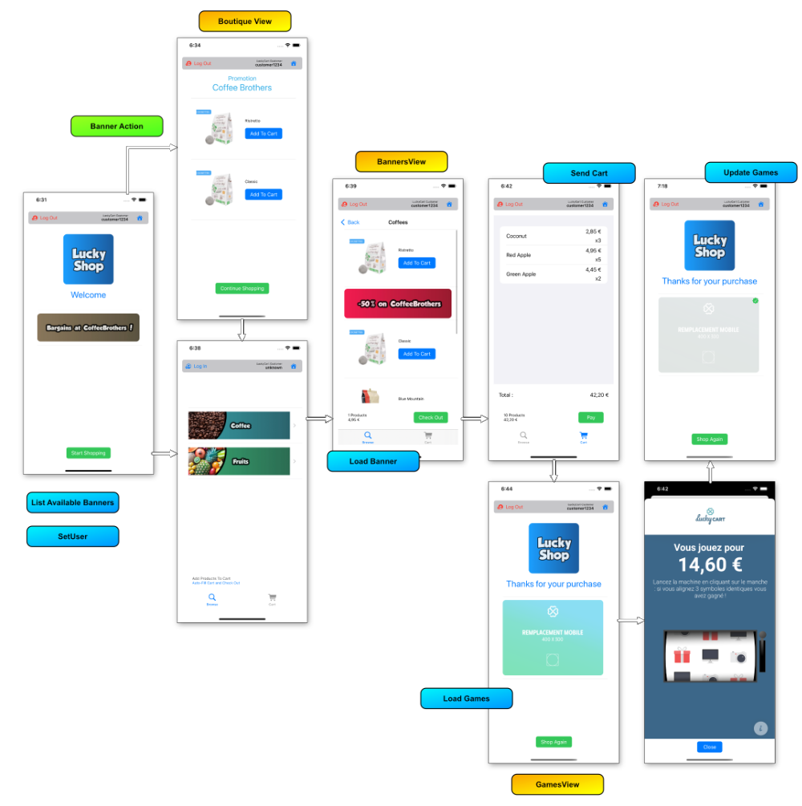

# <font color='#1E72AD'>Lucky Cart</font>

### <font color='#1E72AD'>LuckyCart Framework and Client Sample Application</font>

## <font color='#1E72AD'>Installation:</font>

### <font color='#EF1020'>1 - Install Package</font>

#### Swift Package:

 Add the <b>LuckyCart</b> Package using xCode

#### CocoaPods:

 ```
 pod 'LuckyCart'
 ``` 
 
### <font color='#EF1020'>2 - Download or clone the sample application</font>

All the sample code in this documentation is extracted from the [Client App Sample](https://github.com/lucky-cart/lucky-cart-client-sample-ios) project</font>

It is a simple shopping application draft using a trivial shop model ( Shop, Customer, Cart, Products and Orders ).<br>The project is SwiftUI based and thus runs on iOS and macOS platforms.



## <font color='#1E72AD'>Use in Client Application:</font>


### <font color='#EF1020'>1 - Conform to the `LuckyCartClient` protocol</font>

You can make the application, your main shop manager, or even a newManager class that conform to this protocol to use LuckyCart

This protocol is required at some place in your code to :

- Initialize LuckyCart with your credentials
- Generate the data required by the LuckyCart platform
- Send cart data to the LuckyCart server

 
```swift
public protocol LuckyCartClient {
    
    /// Starts the LuckyCart framework with your ahtentification settings

    func initLuckyCart()
    
    /// Generates the information needed by LuckyCart when checking out

    func luckyCartTicket(cartId: String) throws -> LCTicketComposer
}
```


### <font color='#EF1020'>2 - Start LuckyCart </font>

Starts the LuckyCart framework using authorization, luckyCart customer and cart ids. 

```swift
class MyShopManager: LuckyCartClient {

    func initLuckyCart() {
        let auth = LCAuthorization(key: <authKey>, secret: <secret>)
        LuckyCart(authorization: auth)
    }
}
```

### <font color='#EF1020'>3 - Set the current user</font>

If customer id is not passed in init, you can set it by calling the `setUserId()` function.
Customer id is required to send cart information at checkout time.

```swift
    /// The current customer
    ///
    /// When the current customer currently browsing the shop changes,
    /// we also set the current LuckyCart share instance customer id property.
    
    @Published var customer: Customer? {
        didSet {
            LuckyCart.shared.setUser(customer == nil ? nil : LuckyCart.testCustomer)
        }
    }
```

### <font color='#EF1020'>4 - Display Banners</font>

##### Make the views that should display <b>LuckyCart</b> banners conform to the `BannerSpaceView`.

```swift
public protocol LCBannersView: View {
    var bannerSpaceId: String { get }
    var banners: [LCBanner] { get set }
}
```

##### Implement the properties

- bannerSpaceId: The bannerSpace identifier associated to this view
- banners: A published array of banners.

##### Load the banners

- Call the `loadBanner` function for desired ids when view appears
- Update the views using the received banners and/or errors
    
In this example, a view displays all available banners in a list.

##### Code Sample

```swift
struct HomePageView: LCBannersView {
    
    // The banners array
    var banners: State<[LCBanner]> = State(initialValue: [])
    
    // BannerSpaceView
    var bannerSpaceId: String = LuckyShop.homepage

    var body: some View {        
...

         // MARK: - Display the list of LuckyCart banners -->
                
         List(banners.wrappedValue) { banner in
         		LCSimpleBannerView(banner: banner)
         }
...
        
        // MARK: - Load the LuckyCart banners when the view appears -->
        
        .task {
	        // We add the homePage banner to the list
            loadBanner(bannerId: LuckyShop.homePageBanner, format: LuckyShop.bannerFormat)
        }
        
    }
```

### <font color='#EF1020'>5 - Execute banners action</font>

To make an object receive banner actions, make it conform to `LCActionListener` protocol.

If an action `LCBannerAction` is set on a clicked banner, then the default html view pop up is skipped. Instead a notification is sent to the all `LCActionListener` objects.

```swift
protocol LCActionListener {
    func handleBannerAction(action: LCBannerAction)
}
```

This is how the top container receive action in the sample application project.

```swift
struct ShopView: View, LCActionListener {
    
    // MARK: - Handle banners actions -->

    func handleBannerAction(action: LCBannerAction) {
        switch action.type {
        case .boutique:
            page = .boutique(identifier: String(action.ref))
            break
        default:
            return
        }
    }
    
    var body: some View {
        VStack(alignment: .center, spacing: 16) {
            switch page {
...
            case .boutique(let targetId):
                BoutiqueView(boutiquePageIdentifier: targetId) {
                    page = .shopping
                }
...                
            }
        }
        
        // MARK: - Start to listen to notifications when the view appears -->
        
        .task {
            listenLuckyCartActions()
        }
        .padding()
    }

```

### <font color='#EF1020'>6 - Send relevant cart data to LuckyCart</font>

#### <font color='#AF1020'>A - Prepare the data</font>

Each time your application does a check out, some data are sent to LuckyCart.
The LuckyCart framework uses a simple composer object. `LCTicketComposer` is a utility protocol that aggregates dictionaries and throw some exceptions if duplicate keys are found.
A generic DictionariesComposer is provided to pass a simple dictionary.

In this exemple, we create a simple LCDictionaryComposer with the sample data from the LuckyCart application sample.
It will then be merged with LuckyCart required fields before being sent.


```swift
extension MyShopManager {

    func luckyCartTicket(cartId: String) throws -> LCTicketComposer {
        
        // 1 - Make the array of product json dictionaries
        
        let productComposers = cart.productOrders.map { order in
            [
                Keys.id: order.id.uuidString,
                Keys.quantity: "\(order.quantity)",
                Keys.ttc: LuckyCart.priceString(order.totalPrice),
                Keys.ht: LuckyCart.priceString(order.totalPriceWithoutTax)
            ]
        }
        
        // 2 - Returns full json composer
        return LCDictionaryComposer(dictionary: [
            Keys.loyaltyCart: "myLoyaltyCart",
            
            Keys.email: customer?.eMail,
            Keys.firstName: customer?.firstName,
            Keys.lastName: customer?.lastName,
            
            Keys.shippingMethod: "pickUp",
            Keys.shopId: shopId,
            Keys.device: "ios-sim",
            
            Keys.currency: currency,
            Keys.ttc: LuckyCart.priceString(cart.totalPrice),
            Keys.ht: LuckyCart.priceString(cart.totalPriceWithoutTax),
            Keys.products : productComposers
        ])
    }    
}
```

Client can implement its own composer to make structure based composer.
For example you can extract some properties of a customer object in your own model.

```swift
    struct ProductOrder: LCTicketComposerScope {
        public var id: String
        public var quantity: String
        public var ttc: String
        public var ht: String
        
        public init(id: String,
                    quantity: String,
                    ttc: String,
                    ht: String) {
            self.id = id
            self.quantity = quantity
            self.ttc = ttc
            self.ht = ht
        }
        
        public func makeLuckyCartDictionary() throws -> [String : Any] {
            [
                "quantity": quantity,
                "ttc": ttc,
                "id" : id
            ]
        }
    }


```


#### <font color='#AF1020'>B - Send the data</font>

Once your application did a succesful checkout, call this function to send ticket information to LuckyCart and receive an aknowledgment.

```swift
extension MyShopManager {
    
    /// Send a request to check out and wait for the result
    func checkOut(failure: @escaping (Error)->Void,
                  success: @escaping (LCPostCartResponse)->Void) {
        
        // Sample shop does not send any request, it simply marks the cart as paid
        LuckyCart.shared.checkOut(ticketComposer: ticketComposerForLuckyCart,
                                  failure: { error in
            DispatchQueue.main.async { 
                 // Deal with the error and update your UI 
            }
        }, success: { response in
            DispatchQueue.main.async { 
                 // Deal with LuckyCart answer ( LCPostCartResponse ) and update your UI
                 // This is where the user can browse and play the available games
             }
        })
    }

}
```

### <font color='#EF1020'>7 - Display Games</font>


```swift
struct MyGamesView: GamesView {
        
    @State var games: [LCGame] = []
    
    var body: some View {
        HStack {
            VStack(alignment: .center, spacing: 16) {
                Image("logo").resizable().frame(width: 160, height: 160, alignment: .center)
                Text("Thanks for your purchase")
                
                // Displays the LuckyCart game banners

                // --->
                
                List(games) { game in
                    LCGameView(game: game)
                    .frame(height: 80, alignment: .center)
                }
                
                // <---
            }
        }.task {
            LuckyCart.shared.loadGames { _ in
                print("\(error.localizedDescription)")
            } success: { games in
                self.games = games
            }
        }
    }
}
```


### <font color='#EF1020'>8 - Update Game State</font>

When a game view is closed, games are reloaded with their new state ( playable, lost or won ).
Just update the interface to reflect new games properties.

Advanced Documentation

[LuckyCart Framework Documentation](Documentation.md)

--

©2022 Lucky Cart


